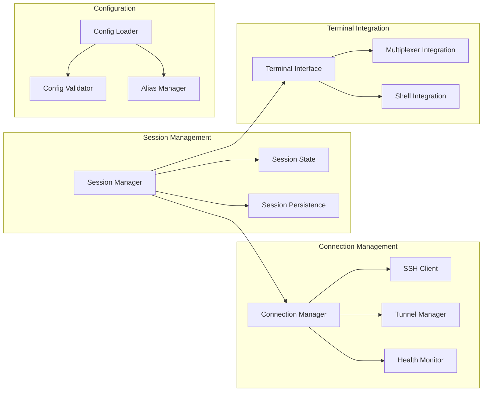
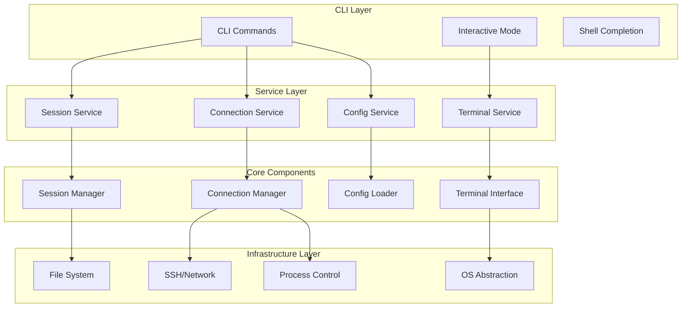
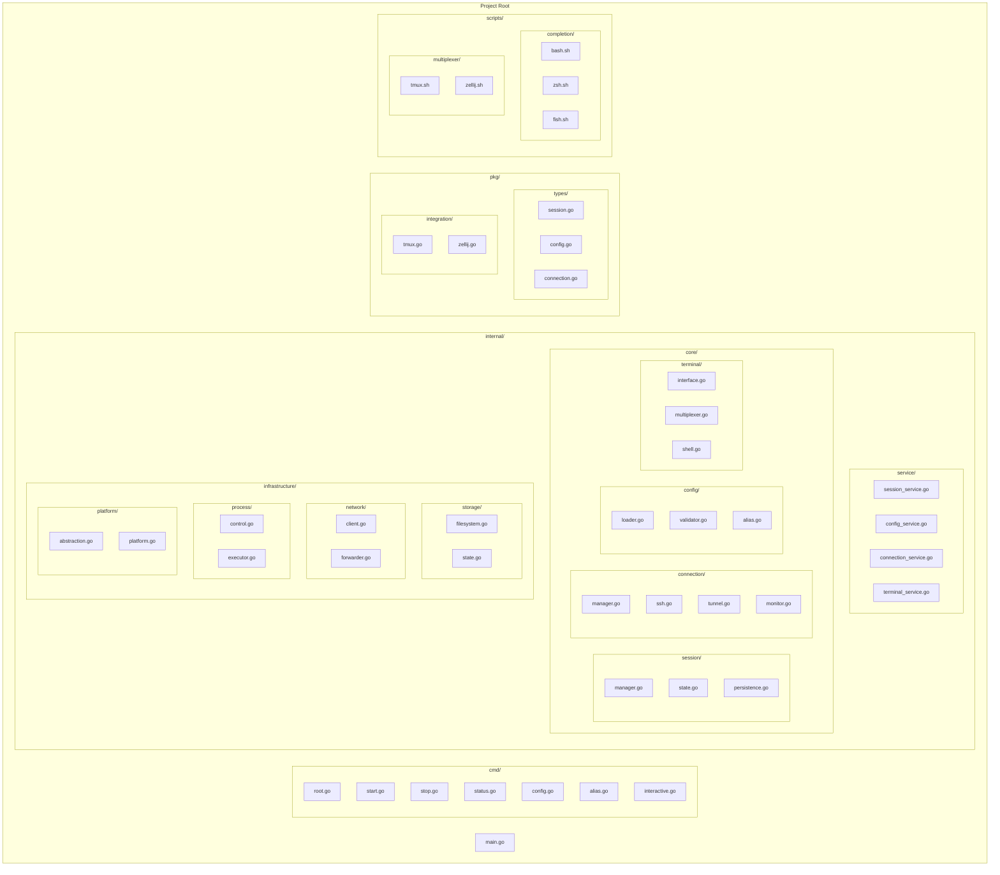
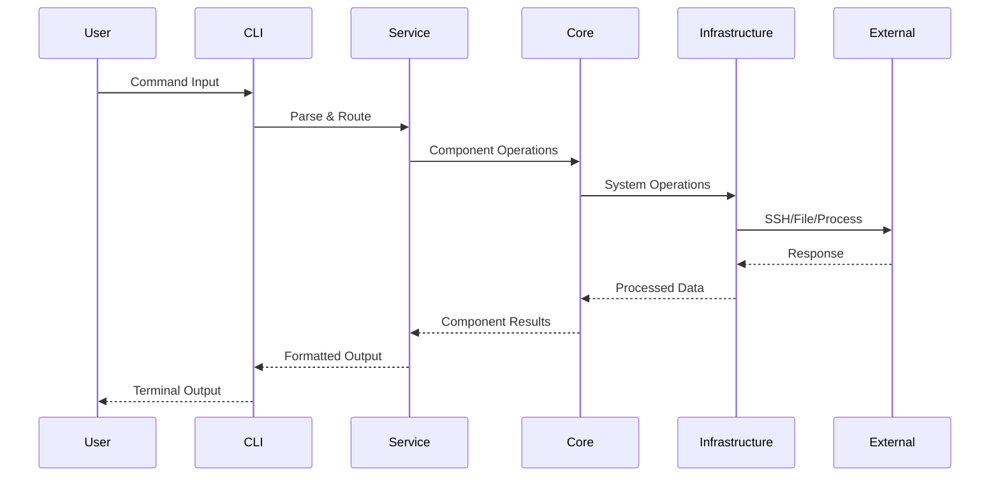
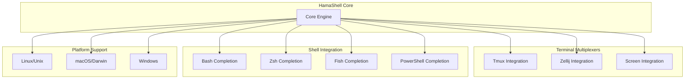

# 🦛 HamaShell

## 🚀 Project Overview

This project is a **session and connection manager** designed for developers who need reliable, secure access to various hosts in single cli command.

It simplifies complex multi-step SSH tunneling and session setup by letting developers define their connections declaratively in a YAML file.

Unlike ad-hoc scripts, it offers **structured, secure, and controllable workflows**, making it easier to manage connections across projects and environments.

## ✨ Why use this tool?

✅ **Declarative & reproducible** — Define connections once in YAML and reuse them easily.

✅ **Secure by design** — Uses system environment variables to keep secrets hidden and safe.

✅ **Full process control** — Start, stop, check status, and manage connections interactively.

✅ **Hierarchical organization** — Organize connections by project and stage.

✅ **Parallel execution** — Run multiple sessions simultaneously without manual orchestration.

✅ **Multi-cloud ready** — Works seamlessly with AWS, Oracle Cloud, Naver Cloud, and on-premise.

✅ **Portable** — Runs on any Linux distro, integrates into CI/CD pipelines, and supports local dashboards for visibility.

## 💡 Core Features

### ✅ YAML-based configuration

* Define complex multi-step tunneling and SSH workflows declaratively.
* Supports dynamic command steps and environment variable substitution.

### ✅ Secure & flexible connections

* SSH with key-based authentication and multi-hop tunneling.
* Leverages environment variables to avoid hardcoding secrets.

### ✅ Powerful connection management

* Persistent and recoverable sessions.
* Process control: start, stop, view status, and monitor connections.
* Port forwarding and connection health checks with automatic retry.

### ✅ Developer-friendly CLI

* Interactive commands for managing sessions.
* Clear status reporting and logs for troubleshooting.

### ✅ Extensible and cloud-ready

* Integrates easily with major cloud providers and on-premises setups.
* Flexible enough to be used in local development, on-premise, or CI/CD pipelines.

## ⬇️ Installation
## 📙 How to use

### ⚙️ Configure

Configure your connections using the simple **project.stage.service** pattern:

```yaml
projects:
  myapp:
    description: "Main application project"
    stages:
      dev:
        services:
          db:
            description: "Develop database"
            commands:
              - "ssh -i ${SSH_KEY_PATH} ${BASTION_USER}@bastion.dev.com"
              - "${DEV_DB_PW}"
          api-server:
            description: "Develop database"
            commands:
              - "aws configure ,,,"
              - "aws ssm ,,,"
      prod:
        services:
          db:
            description: "Production database"
            commands:
              - "ssh -i ${SSH_KEY_PATH} ${BASTION_USER}@bastion.prod.com"
              - "${PROD_DB_PW}"
# Global settings
global_settings:
  timeout: 30
  retries: 3
  auto_restart: true
```

**Configuration Structure:**

* **`projects`** - Your project name (e.g., `myapp`, `ecommerce`)
* **`stages`** - Environment stage (e.g., `dev`, `staging`, `prod`)
* **`services`** - Service type (e.g., `db`, `server`, `jenkins`, `redis`, `api`)

Each service can have:
- **`host`** - Target hostname
- **`user`** - SSH username (supports env vars like `${USER}`)
- **`key`** - SSH key path (supports env vars like `${SSH_KEY_PATH}`)
- **`tunnel`** - Port forwarding (format: `local_port:remote_host:remote_port`)
- **`steps`** - Multi-step commands for complex connections

### ⌨ Commands

**Configuration Management:**

```shell
# Initialize new configuration
hama-shell init                  # Create new config.yaml with interactive prompts
```

**Session Management:**

```shell
# Run shell sessions
hama-shell run [session-name]    # Start/run a configured session

# Kill active sessions
hama-shell kill [session-name]   # Stop/kill running sessions

# Explain session commands
hama-shell explain [session-name] # Show what commands a session will execute
```

**Monitoring and Dashboard:**

```shell
# View dashboard
hama-shell dashboard             # Show interactive dashboard of all sessions
```

### 🍀 Example Usage Scenarios

```shell
# Initial setup
hama-shell init                  # Interactive configuration setup

# Basic session management
hama-shell run myapp.dev.db      # Start database session
hama-shell explain myapp.dev.db  # See what commands will be executed
hama-shell dashboard             # Monitor all active sessions
hama-shell kill myapp.dev.db     # Stop the session
```

```shell
# Development workflow
hama-shell run myapp.dev.server  # Start application server
hama-shell run myapp.dev.db      # Start database connection
hama-shell dashboard             # Monitor both sessions
```

## 🏗️ Architecture

HamaShell is designed with a clean, component-based architecture that promotes flexibility, maintainability, and cross-platform compatibility. The architecture centers around four core component groups with clear interfaces and responsibilities.

### Core Component Architecture



### Layered Architecture



### Package Structure



### Component Flow Architecture



### Cross-Platform Integration Points



### Integration Features

#### Terminal Multiplexer Support
- **Tmux**: Session creation, window management, pane splitting, layout management
- **Zellij**: Layout configuration, plugin integration, session persistence
- **Screen**: Basic session support and window management

#### Shell Integration
- **Completion Scripts**: Auto-completion for all commands and aliases
- **Environment Variables**: Seamless integration with shell environments
- **Path Resolution**: Smart path handling across different shells

#### Cross-Platform Features
- **Process Management**: Unified process handling across OS platforms
- **File System**: Cross-platform file operations and path handling
- **Network Stack**: Platform-specific network optimizations
- **Terminal Handling**: Native terminal integration per platform

### Architecture Benefits

#### Component-Based Design
- **Clear Responsibilities**: Each component has a focused, well-defined purpose
- **Loose Coupling**: Components interact through well-defined interfaces
- **High Cohesion**: Related functionality grouped within components
- **Easy Testing**: Interface-driven design enables comprehensive unit testing

#### Scalability & Extensibility
- **Service Layer**: Clean abstraction between CLI and core components
- **Interface-Driven**: Easy to add new implementations and protocols
- **Modular Structure**: Components can be developed and tested independently
- **Plugin Architecture**: Clean interfaces enable easy plugin development

#### Cross-Platform Compatibility
- **OS Abstraction**: Platform-specific code isolated in infrastructure layer
- **Terminal Agnostic**: Works with tmux, zellij, screen, and native terminals
- **Shell Universal**: Supports bash, zsh, fish with auto-completion
- **Multiplexer Integration**: Seamless integration with popular multiplexers

#### Maintainability & Reliability
- **Separation of Concerns**: Core logic separated from infrastructure details
- **Dependency Injection**: Enables mocking and comprehensive testing
- **Error Handling**: Consistent error propagation across components
- **State Management**: Clear session state handling and persistence

This component-based architecture provides a solid foundation for HamaShell that maintains simplicity while supporting complex session management scenarios across multiple platforms and terminal environments.