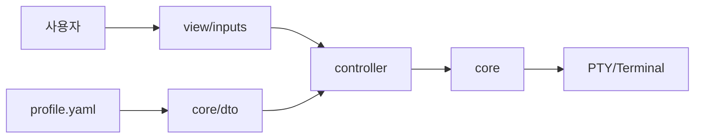
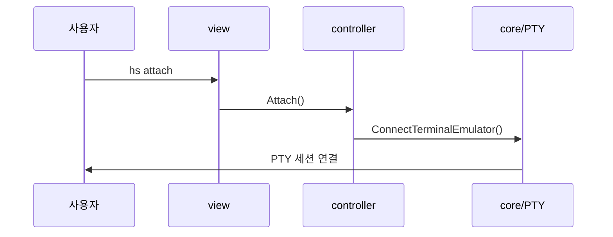

# 🦛 HamaShell
# 구축배경

- **왜 필요한가?**

  서버 상태 체크나 특정 인프라 변경을 명령어로 실행하고자 한다면 명령어들을 나열해서 실행해야하는 상황이 많다.

  가령 개발서버에 들어가서 컨테이너 상태를 보고 싶다면

    1. vpn 을 키고
    2. ssh 를 통해 서버 접속하고 (vault 를 쓴다면 vault 에 대한 인증프로세스도 사용)
    3. docker logs 혹은 kubectl get pods 등등을 처리

  할 수 있을 것이다.

  문제는 이 연속적인 명령어 묶음이 반복된다는 것이다. 특히 같은 프로젝트에 스테이지만 다르다면 특정 명령어만 바뀐다.

  이러한 상황에 대해 명령어 목록을 하나의 파일로 선언하고, 딸깍 한 번으로 프로젝트 별 명령어들을 실행하고 싶었다.

  또한 multiplexer 들처럼 attach/dettach/kill 과 같은 명령어로 이에 대한 생명주기를 관리하고 싶었다.

- **기존 도구와의 차이**
    - `make`: 빌드 의존성은 잘 처리하지만 attach/detach 불가.
    - `tmux`: attach/detach는 되지만 명령 관리/재시작 정책이 약함.
    - **hama-shell**: 두 장점을 결합 → “명령어 레지스트리 + 세션 관리 + PTY 제공”.

# 요구사항

- `hs` :  TUI 접속
- `hs list(ls`) : 현재 실행 중인 세션 보기 (예: `hs ls` → ID, 상태, 시작시간)
    - 나열한 세션이 곧 아래 명령어들의 <session>
- `hs <session> attach(a)` : 실행 중인 프로세스의 TTY에 접속
- `hs <session> dettach` : 붙어있던 세션에서 빠져나오기 (Ctrl+B+D 같은 키 바인딩 설명 필요)
- `hs <session> kill(k)` : 세션 종료
- `hs <session> commands(cmds)` : 등록된 명령 목록 보기
- `hs config view` : config 파일 cat 처리
- `hs config edit` : config 파일 편집/생성
- `hs config add` : 실행할 명령 등록
    - Alt + c 누르면 명령어 입력 프로세스 아예 취소
    - Alt + f 누르면 명령어 입력 완료 및 저장
- `hs help` : 사용법 안내

## 비기능

- linux/macos 기반 (윈도우도 지원되면 좋지만 이후 추가개발)
- 명령어 실패 원인이 확인 되어야 할 것
- 언제든 dettach 되더라도 백그라운드로 실행되고 있어야 함
- light weight as possible.
- 손 쉽게 설치되고 손 쉽게 지워져야 함.
- 명령어 config 파일에 대해 환경변수 지원.

# 프로젝트 구조도 및 컴포넌트 책임

## 디렉토리 구조

```
hama-shell/
├── main.go           # 진입점 (데몬/CLI 모드 분기)
├── view/             # CLI 명령어 처리 (Cobra)
├── controller/       # 비즈니스 로직
├── core/             # 핵심 기능 (PTY, DTO)
└── global/           # 공통 유틸리티
```

## 아키텍처


```mermaid
graph LR
    A[사용자] --> B[view/inputs]
    B --> C[controller]
    C --> D[core]
    D --> E[PTY/Terminal]

    F[profile.yaml] --> G[core/dto]
    G --> C
```

## 컴포넌트 책임

| 컴포넌트 | 책임 |
|---------|------|
| **main.go** | 애플리케이션 진입점, 데몬/CLI 모드 분기 |
| **view/** | CLI 명령어 입력 처리 (Cobra 기반) |
| **controller/** | 세션 관리, 데몬 프로세스 제어 |
| **core/** | PTY 생성/관리, YAML 파싱, 터미널 에뮬레이션 |
| **global/** | 로깅, 에러 처리 등 공통 기능 |

## 주요 흐름


```mermaid
sequenceDiagram
    participant U as 사용자
    participant V as view
    participant C as controller
    participant P as core/PTY

    U->>V: hs attach
    V->>C: Attach()
    C->>P: ConnectTerminalEmulator()
    P->>U: PTY 세션 연결
```
