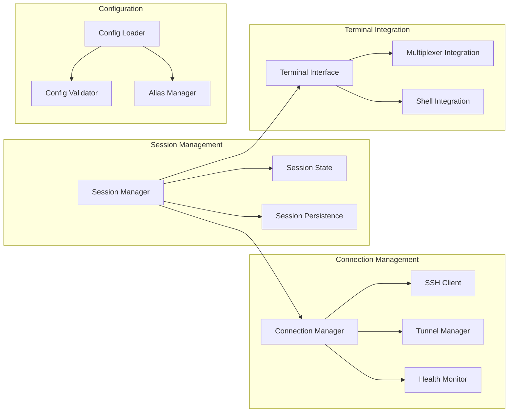
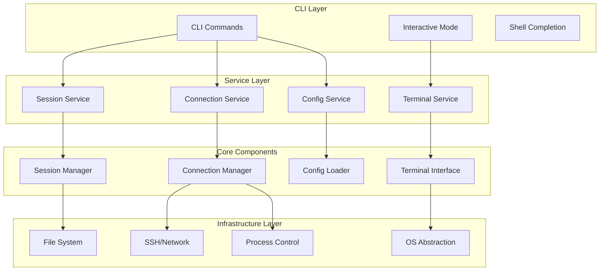
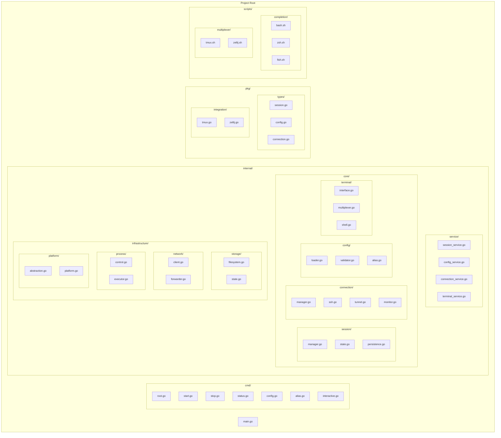
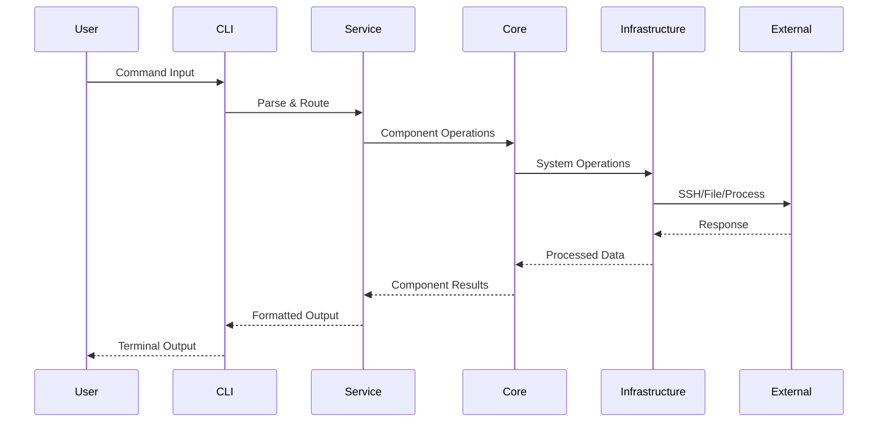
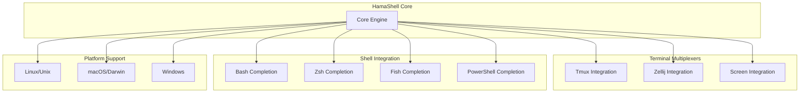

# HamaShell Component Architecture

## Overview
HamaShell is designed with a clean, component-based architecture that promotes flexibility, maintainability, and cross-platform compatibility. The architecture centers around four core component groups with clear interfaces and responsibilities.

## Core Component Architecture



## Layered Architecture



## Package Structure



## Component Flow Architecture



## Core Component Interfaces

### Session Management
```go
type SessionManager interface {
    Create(config SessionConfig) (*Session, error)
    Start(sessionID string) error
    Stop(sessionID string) error
    GetStatus(sessionID string) (SessionStatus, error)
    List() ([]*Session, error)
}

type SessionState interface {
    Save(session *Session) error
    Load(sessionID string) (*Session, error)
    Delete(sessionID string) error
}

type SessionPersistence interface {
    Store(session *Session) error
    Retrieve(sessionID string) (*Session, error)
    Remove(sessionID string) error
}
```

### Connection Management
```go
type ConnectionManager interface {
    Connect(config ConnectionConfig) (Connection, error)
    Disconnect(connectionID string) error
    GetStatus(connectionID string) (ConnectionStatus, error)
    List() ([]Connection, error)
}

type SSHClient interface {
    Connect(host string, config SSHConfig) error
    Execute(command string) ([]byte, error)
    Disconnect() error
}

type TunnelManager interface {
    CreateTunnel(config TunnelConfig) (Tunnel, error)
    CloseTunnel(tunnelID string) error
    ListTunnels() ([]Tunnel, error)
}

type HealthMonitor interface {
    Monitor(connectionID string) (<-chan HealthStatus, error)
    CheckHealth(connectionID string) (HealthStatus, error)
    StopMonitoring(connectionID string) error
}
```

### Configuration
```go
type ConfigLoader interface {
    Load(path string) (*Config, error)
    LoadFromBytes(data []byte) (*Config, error)
    Reload() (*Config, error)
}

type ConfigValidator interface {
    Validate(config *Config) error
    ValidateSession(session SessionConfig) error
}

type AliasManager interface {
    Resolve(alias string) (string, error)
    List() (map[string]string, error)
    Add(alias, path string) error
    Remove(alias string) error
}
```

### Terminal Integration
```go
type TerminalInterface interface {
    Attach(sessionID string) error
    Detach(sessionID string) error
    SendInput(sessionID string, input []byte) error
    GetOutput(sessionID string) (<-chan []byte, error)
}

type MultiplexerIntegration interface {
    CreateSession(name string, config MultiplexerConfig) error
    AttachToSession(sessionID string) error
    DetachFromSession(sessionID string) error
    ListSessions() ([]MultiplexerSession, error)
}

type ShellIntegration interface {
    ExecuteCommand(command string) ([]byte, error)
    SetEnvironment(env map[string]string) error
    GetCompletion(input string) ([]string, error)
}
```

## Cross-Platform Integration Points



## Integration Features

### Terminal Multiplexer Support
- **Tmux**: Session creation, window management, pane splitting, layout management
- **Zellij**: Layout configuration, plugin integration, session persistence
- **Screen**: Basic session support and window management

### Shell Integration
- **Completion Scripts**: Auto-completion for all commands and aliases
- **Environment Variables**: Seamless integration with shell environments
- **Path Resolution**: Smart path handling across different shells

### Cross-Platform Features
- **Process Management**: Unified process handling across OS platforms
- **File System**: Cross-platform file operations and path handling
- **Network Stack**: Platform-specific network optimizations
- **Terminal Handling**: Native terminal integration per platform

## Architecture Benefits

### Component-Based Design
- **Clear Responsibilities**: Each component has a focused, well-defined purpose
- **Loose Coupling**: Components interact through well-defined interfaces
- **High Cohesion**: Related functionality grouped within components
- **Easy Testing**: Interface-driven design enables comprehensive unit testing

### Scalability & Extensibility
- **Service Layer**: Clean abstraction between CLI and core components
- **Interface-Driven**: Easy to add new implementations and protocols
- **Modular Structure**: Components can be developed and tested independently
- **Plugin Architecture**: Clean interfaces enable easy plugin development

### Cross-Platform Compatibility
- **OS Abstraction**: Platform-specific code isolated in infrastructure layer
- **Terminal Agnostic**: Works with tmux, zellij, screen, and native terminals
- **Shell Universal**: Supports bash, zsh, fish with auto-completion
- **Multiplexer Integration**: Seamless integration with popular multiplexers

### Maintainability & Reliability
- **Separation of Concerns**: Core logic separated from infrastructure details
- **Dependency Injection**: Enables mocking and comprehensive testing
- **Error Handling**: Consistent error propagation across components
- **State Management**: Clear session state handling and persistence

This component-based architecture provides a solid foundation for HamaShell that maintains simplicity while supporting complex session management scenarios across multiple platforms and terminal environments.